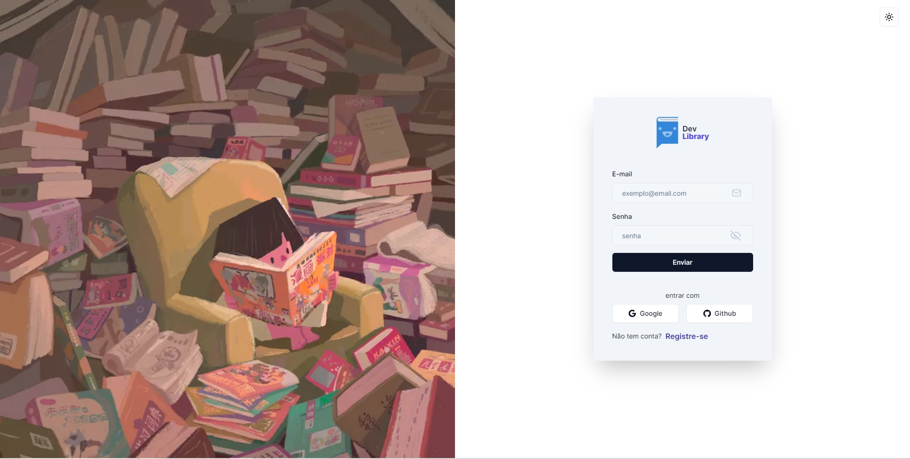

# [BookStore]

Esta é uma biblioteca/livraria construída com o Next.js 13.

[](https://the-book-is-on-the-library-4xg8y9pjc-evertonleonel.vercel.app/)

> **Atenção**
> Este projeto é apenas um estudo de caso.

## Tech Stack

- **Framework:** [Next.js](https://nextjs.org)
- **Styling:** [Tailwind CSS](https://tailwindcss.com)
- **User Management:** [Clerk](https://clerk.com)
- **ORM:** [Prisma](https://www.prisma.io/)
- **UI Components:** [shadcn/ui](https://ui.shadcn.com)

## Funcionalidades a serem implementadas

- [x] Autenticação com **Clerk**
- [x] ORM usando **Prisma ORM**
- [x] Database on **Railway**
- [x] Validação com **Zod**

## Running Locally

1. Clone o repositório

```bash
git clone https://github.com/evertonleonel/the-book-is-on-the-library.git
```

2. Instale as dependências usando npm

```bash
npm install
```

3. Copie o .env.example para .env e atualize as variáveis.

```bash
cp .env.example .env
```

4. Iniciar o servidor de desenvolvimento

```bash
npm run dev
```

5. Suba o database

```bash
npm run db:push
```
